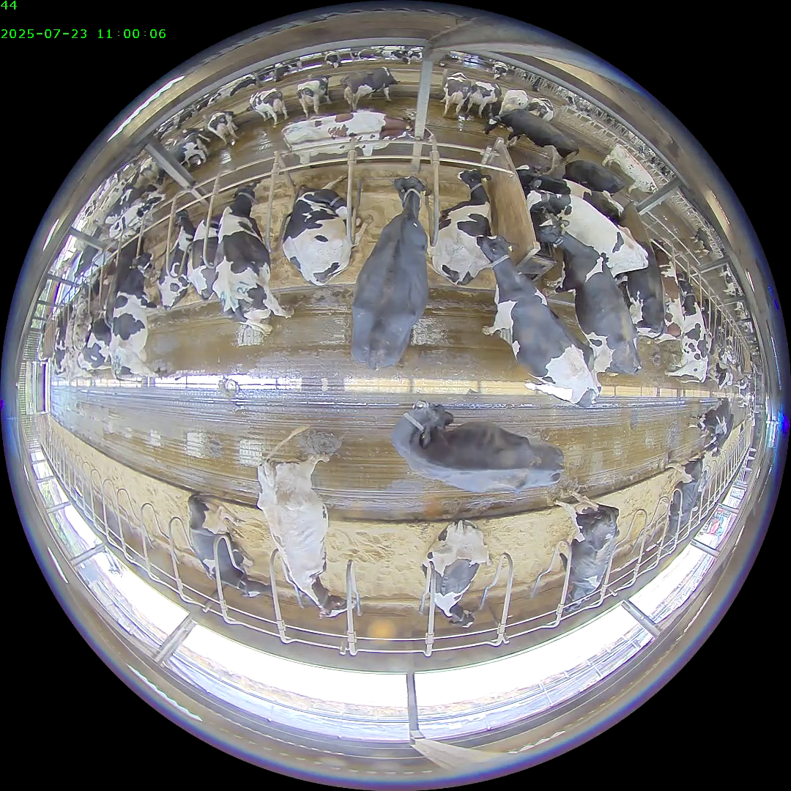
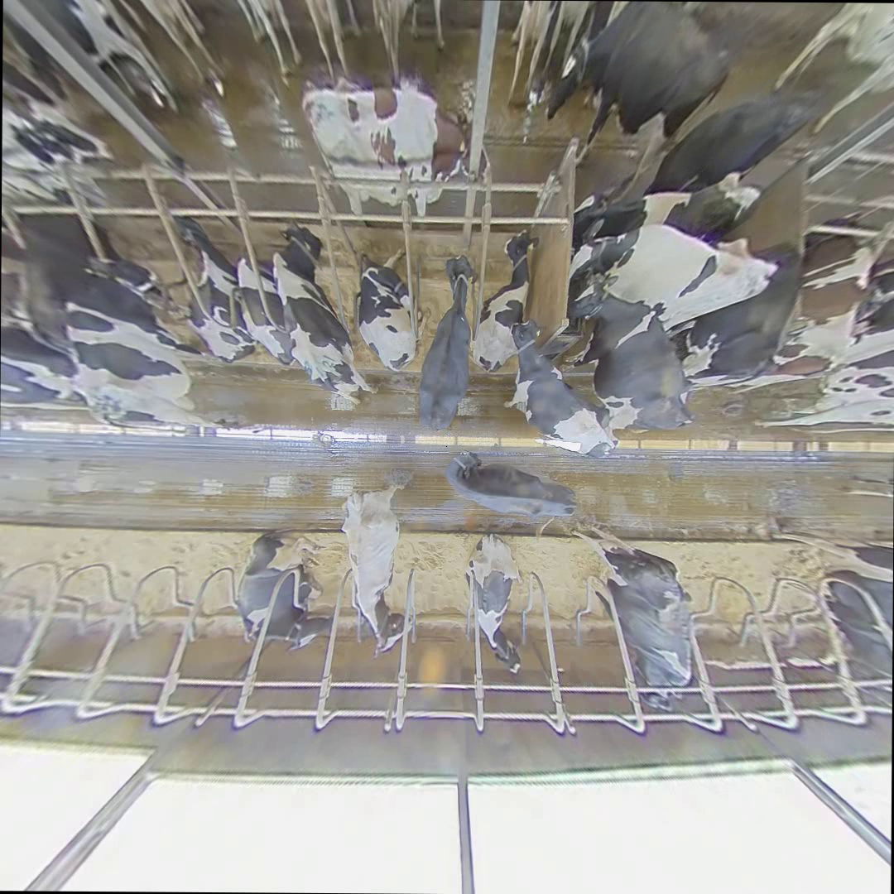

# UoB Video Dewarp

This project provides a simple GUI tool that allows University of Bristol collaborators to easily de-warp fisheye videos.

---

## Before / After Dewarp Comparison

| Original (Fisheye) | Dewarped Output |
|--------------------|-----------------|
|  |  |


## Installation (Development)
### 1. Clone the repository
```bash
git clone https://github.com/biospi/UoBDewarp
cd UoBDewarp
```
### 2. Create a virtual environment (recommended)
```bash
python -m venv .venv
.\.venv\Scripts\activate   # on Windows
source .venv/bin/activate  # on macOS/Linux
```
### 3. Install dependencies
```bash
pip install -r requirements.txt
```
### 4. Run the GUI
```bash
python dewarp_tool.py
```

## Building Executable (Windows)

You can package this into a single .exe file so that collaborators don’t need Python installed.

1. Install PyInstaller

```bash
pip install pyinstaller
```

2. Build the executable
```bash
pyinstaller --onefile --noconsole --icon=uob.ico dewarp_tool.py
```

3. Distribute

The resulting .exe will be inside the dist/ folder:
```bash
dist/dewarp_tool.exe
```
Send this file to colleagues.

##  Prerequisite

- Python 3.9+ (for development)
- FFMPEG https://www.ffmpeg.org/download.html

```bash
Project Structure
.
├── dewarp_tool.py           # Main GUI app
├── requirements.txt         # Python dependencies
├── README.md                # Project documentation
└── uob.ico                  # UoB logo (optional, for icon)
```


---

##  requirements.txt

```txt
ttkbootstrap
opencv-python